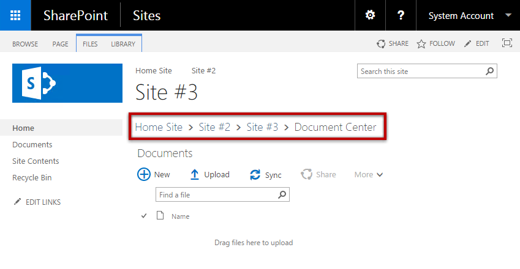

Para entrar a azure es bueno tener conocimiento de los nombres y como navegar dentro de el. Asi en futuros trabajos con Azure estarás mas familiarizado con los términos y no te perderás tanto entre lecturas.

## Blades

Las paginas Servicios/Recursos en el Portal de Azure en algunas ocasiones son referidas como *blades*. Cuando abres una pagina de Service Health por ejemplo estas abriendo el blade de Service Health.

Azure Portal usa los blades como un tipo de patrón de navegación, abre un blade a la derecha con cada servicio cada que vas adentrando en el. Es muy similar a la forma de navegación llamada breadcrumb (miga de pan) conforme navegas horizontalmente.

