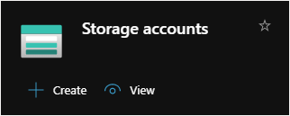

## Recursos necesarios

- Device Provision Services
- Logic Apps
- Steam Analytics jobs
- Storage Accounts

## Logic Apps

## Device Provision Service

Use IoT Hub Device Provisioning Service to automate IoT devices provisioning and registration.

## Stream Analytics Jobs

## Storage Account

Create a storage account to stre up to 500TB of data in the cloud. Use a general-purpose storage account to store object data, use a NoSQL data store, define and use queues for message  processing, and set up file shares in the cloud. Use the Blob storage account and the hot or cool access tier to optimize your cost based on how frequently you object data is accessed.

